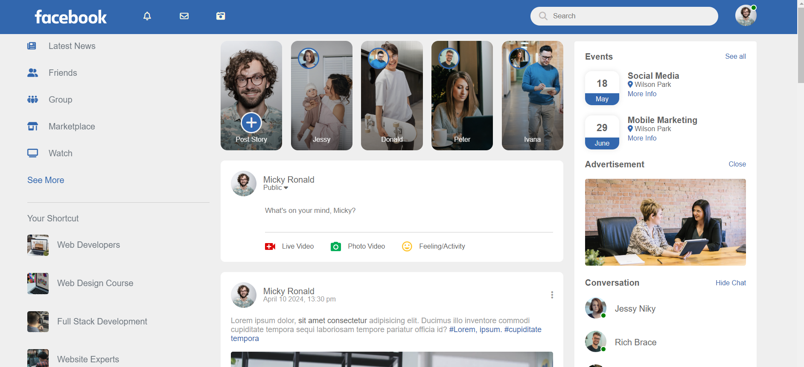

# Facebook Clone
[Demo](https://ummahanakcanfacebookclone.netlify.app/)

## Project Overview
- While developing the project, I followed a tutorial on [YouTube Video](https://www.youtube.com/watch?v=NljIHlZRTTE&ab_channel=GreatStack). Unlike the tutorial, I used SCSS in this project, which led to encountering some issues as the project progressed. Specifically, the lack of automatic reflection of SCSS changes in JavaScript, while possible in CSS, required me to revise the JavaScript code to enable toggling between dark and light modes in the main project. You can review the detailed solutions by examining the project. 
